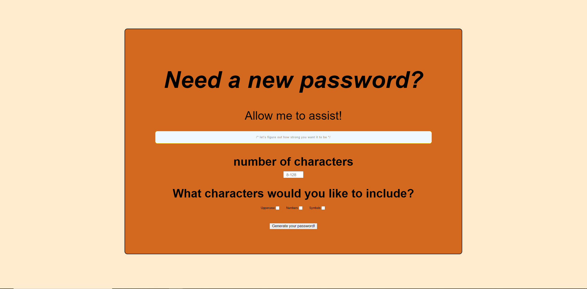
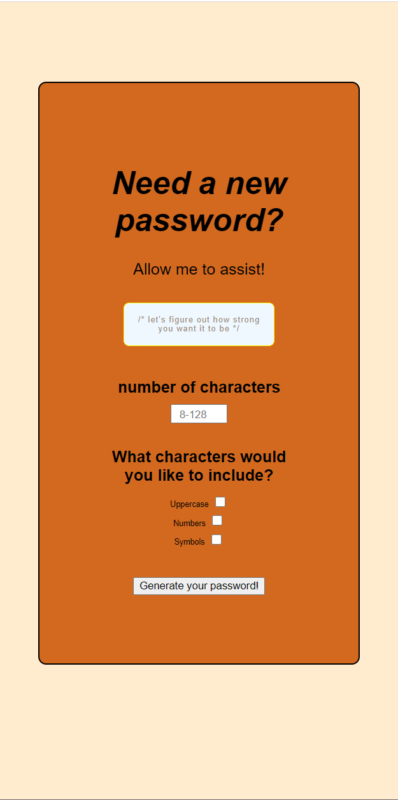

# Forest Wilson - Homework 3 - Password Generator

I hope you are in need of hundreds of new passwords, because this generator is ready to turn them out.

## Comments

Originally I wanted a dropdown box that a user could select an option that will be passed into the generate function, but I couldnt figure out how to taget its value as I would with the number picker, so I instead opted to use checkboxs where i could just look at the value through .checked. I like this tactic more though because i think I would have had issues formatting the conditional statement if I was not able to simply pass an is-true argument.

shoutout to "Web Dev Simplified" for giving me the idea of using the UTF-16 values and fromCharCode() to generate and decypher my arrays instead of typing them out manually. 

In the future I would like to change the 
 field that the password prints to into an input field to make copying the password easier. I also wanted to add another button that copies this value to your clipboard, but I think at this point in time I should save this for a future deployment.

## Screenshot

## Relevant links

